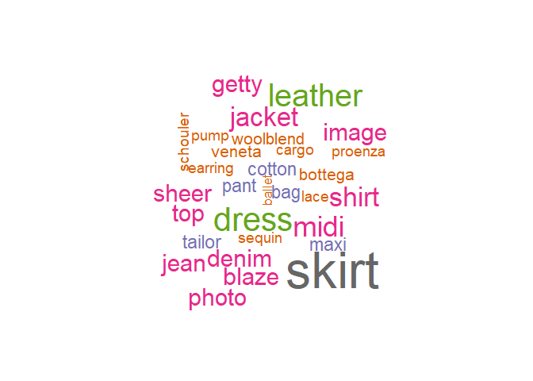
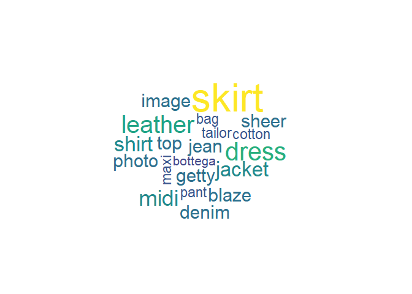
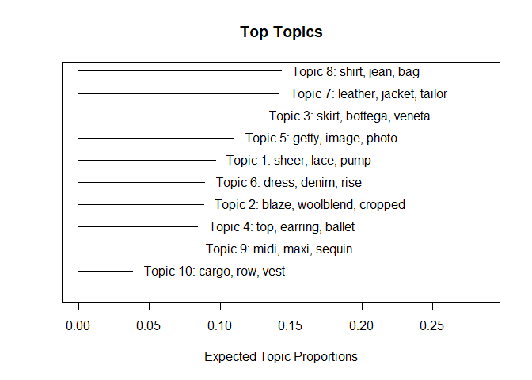

### Top 2023 Fashion Trends

As fashion weeks are underway, it is always fun to get an idea of what
trends we will see hitting the runways.

To get a better idea of key trends consumers can expect to see more
frequently from designers, I decided to run a topic model on the top 10
results of 2023 fashion trends.

Load in necessary libraries:

    library(rvest)
    library(stringr)

To start, I scraped in 10 different fashion articles.

**Refinery29:**

    refinery <- read_html("https://www.refinery29.com/en-us/fashion-trends-2023")|> 
      html_elements("h2") |> html_text()

    ## clean refinery

    refinery1 <- gsub("2023", "", refinery)

    refinery2 <- gsub("Fashion\\sTrend", "", refinery1)

    refinery3 <- gsub("Refinery.*", "", refinery2)

**Hello!:**

    hello <- read_html("https://www.hellomagazine.com/hfm/20221017154410/2023-fashion-trends-to-have-on-your-radar/")|>   html_elements("strong") |> html_text()

    ## clean Hello

    hello1 <- gsub("\\s\\s+", "", hello)

    hello2 <- gsub("SHOP\\sNOW", "", hello1)

    hello3 <- gsub("^RELATED.*|^READ.*|^MORE.*|^Hello!.*|^More\\son.*|^HELLO.*", "", hello2)

    hello4 <- gsub("^READ.*", "", hello3)

    hello <- gsub("Spring\\s2023\\s[Tt]rends", "", hello4)

    hello <- gsub("Summer\\s2023\\s[Tt]rends", "", hello)

    hello <- hello[-c(64)]

**Vogue:**

    vogue <- read_html("https://www.vogue.com/article/spring-2023-trends-editors-picks")|> html_elements("h2") |> html_text()

    ## clean Vogue:

    vogue1 <- gsub("^By\\s[A-Z].*", "", vogue)

    vogue2 <- gsub("revist.*|Vogue.*|commerce.*|editor", "", vogue1)

    vogue <- gsub("[Ss]ign\\sup.*|[Ss]igning\\sup.*", "", vogue2)

**Glamour:**

    glamour <- read_html("https://www.glamour.com/story/2023-style-trends") %>%  html_elements("strong") %>%  html_text

    glamour1 <- gsub("^By\\s[A-Z].*|Courtesy.*", "", glamour)

    glamour2 <- gsub("revisit.*", "", glamour1)

    glamour <- gsub("2023\\sStyle\\sTrend:", "", glamour2)

**Insider:**

    insider <- read_html("https://www.insider.com/fashion-clothing-trends-coming-this-year-2023#lug-sole-loafers-will-remain-a-strong-trend-1") %>% html_elements("h2") %>% html_text

**Elle:**

    elle <- read_html("https://www.elle.com/fashion/trend-reports/a41340278/spring-2023-fashion-trends/") %>% html_elements("h2") %>% html_text

**Woman and Home:**

    womanhome <- read_html("https://www.womanandhome.com/fashion/fashion-trends-2023/") %>% html_elements("span") %>% html_text

    womanhome1 <- gsub("opens.*", "", womanhome)

    wh2 <- gsub("Sign.*", "", womanhome1)

    wh3 <- gsub("[(]", "", wh2)

    wh4 <- gsub("^\\d+\\.\\s", "", wh3)

    womanhome <- wh4[-c(1:41)]

    womanhome <- womanhome[-c(184:219)]

**Forbes:**

    forbes <- read_html("https://www.forbes.com/sites/sboyd/2023/01/28/the-9-fashion-trends-youre-about-to-see-everywhere-in-2023/?sh=11d4fb25b05d") %>% html_elements("h2") %>% html_text

    forbes <- gsub("^\\d+\\)\\s", "", forbes)

**Glamour UK:**

    glamour_UK <- read_html("https://www.glamourmagazine.co.uk/gallery/spring-summer-2023-fashion-trends") %>% html_elements("span") %>% html_text

    glamour_UK1 <- glamour_UK[-c(92:131)]
      
    glamour_UK1 <- gsub("^By\\s.*", "", glamour_UK1)

    glamour_UK1 <- glamour_UK1[-c(1:36)]

    glamour_UK <- gsub("([A-Z][a-z]+).*", "", glamour_UK1)

    bazaar <- read_html("https://www.harpersbazaar.com/fashion/trends/a41247745/spring-2023-fashion-trends/") %>% html_elements("p") %>% html_text

    bazaar1 <- bazaar[-c(1:2)]

    bazaar <- bazaar1[-c(7:24)]

**Combine articles:**

    all_articles <- c(hello, vogue, glamour, insider, elle, womanhome, forbes, glamour_UK, bazaar)

    all_articles2 <- gsub("-", "", all_articles)

Load in necessary libraries:

    library(dplyr)

    ## Warning: package 'dplyr' was built under R version 4.2.3

    ## 
    ## Attaching package: 'dplyr'

    ## The following objects are masked from 'package:stats':
    ## 
    ##     filter, lag

    ## The following objects are masked from 'package:base':
    ## 
    ##     intersect, setdiff, setequal, union

    library(quanteda)

    ## Warning: package 'quanteda' was built under R version 4.2.2

    ## Package version: 3.2.4
    ## Unicode version: 13.0
    ## ICU version: 69.1

    ## Parallel computing: 12 of 12 threads used.

    ## See https://quanteda.io for tutorials and examples.

    library(stm)

    ## Warning: package 'stm' was built under R version 4.2.2

    ## stm v1.3.6 successfully loaded. See ?stm for help. 
    ##  Papers, resources, and other materials at structuraltopicmodel.com

    library(tm)

    ## Warning: package 'tm' was built under R version 4.2.2

    ## Loading required package: NLP

    ## 
    ## Attaching package: 'NLP'

    ## The following objects are masked from 'package:quanteda':
    ## 
    ##     meta, meta<-

    ## 
    ## Attaching package: 'tm'

    ## The following object is masked from 'package:quanteda':
    ## 
    ##     stopwords

    library(textstem)

    ## Warning: package 'textstem' was built under R version 4.2.2

    ## Loading required package: koRpus.lang.en

    ## Warning: package 'koRpus.lang.en' was built under R version 4.2.2

    ## Loading required package: koRpus

    ## Warning: package 'koRpus' was built under R version 4.2.2

    ## Loading required package: sylly

    ## Warning: package 'sylly' was built under R version 4.2.2

    ## For information on available language packages for 'koRpus', run
    ## 
    ##   available.koRpus.lang()
    ## 
    ## and see ?install.koRpus.lang()

    ## 
    ## Attaching package: 'koRpus'

    ## The following object is masked from 'package:tm':
    ## 
    ##     readTagged

    ## The following objects are masked from 'package:quanteda':
    ## 
    ##     tokens, types

**Text cleaning & prep of combined articles**

    articles_lowered <- tolower(all_articles2)

    df <- data.frame(articles_lowered)

    articles_df <- df[!apply(df==""|df==" ", 1, all),]

    articles_df <- articles_df[-c(5:6)]

    articles_df <- gsub("[Ff]ashion|[Tt]rend|[Tt]rends|[Pp]aris|[Ss]pring|[Ss]tory|[Rr]unway|[Rr]unways|[Ll]ook|[Ll]ooks", "", articles_df)

    articles_df <- gsub("([[:punct:]])", "", articles_df)

    articles_df <- gsub("[Nn]ew\\s[Yy]ork|[Ww]eek|[Ss]eason", "", articles_df)

    removed_words <- tm::removeWords(tolower(articles_df), words = stopwords("en"))

    lemma_dictionary <- make_lemma_dictionary(removed_words,   
                                              engine = 'hunspell')

    articles_lemmatized <- lemmatize_strings(removed_words, 
                                              lemma_dictionary)

**Create the corpus with document variables**

    fashion_corpus <- corpus(articles_lemmatized)

    fashion_token <- quanteda::tokens(fashion_corpus, remove_punct = TRUE, remove_symbols = TRUE, remove_numbers = TRUE)

    fashion_dfm <- dfm(fashion_token)

    fashion_dfm <- dfm_trim(fashion_dfm, sparsity = 0.990)

    fashion_stm <- convert(fashion_dfm, to = "stm")

    ## Warning in dfm2stm(x, docvars, omit_empty = TRUE): Dropped empty document(s):
    ## text1, text2, text5, text7, text9, text11, text13, text14, text15, text17,
    ## text18, text19, text21, text23, text25, text28, text29, text30, text32, text34,
    ## text35, text36, text38, text39, text40, text42, text43, text44, text46, text47,
    ## text48, text49, text51, text53, text54, text55, text62, text68, text74, text77,
    ## text92, text110, text119, text121, text122, text132, text134, text149, text164,
    ## text170, text188, text194, text196, text201, text202, text203, text204, text205,
    ## text206, text207, text208, text217, text219, text222, text226, text229, text230,
    ## text232, text233, text234, text235, text236, text237, text238, text239, text240,
    ## text241, text242, text243, text244, text246, text247, text248, text250, text252,
    ## text253, text254, text256, text257, text258, text259, text260, text262, text263,
    ## text264, text265, text266, text267, text268, text269, text271, text272, text273,
    ## text274, text276, text277, text278, text279, text281, text282, text283, text284,
    ## text285, text287, text288, text289, text290, text292, text293, text294, text295,
    ## text296, text297, text298, text299, text300, text301, text302, text303, text304,
    ## text305, text307, text308, text309, text311, text314, text315, text316, text321,
    ## text323, text324, text326

    docs_stm <- fashion_stm$documents 
    vocab_stm <- fashion_stm$vocab    
    meta_stm <- fashion_stm$meta

    fashionPrep <- prepDocuments(documents = docs_stm, 
                               vocab = vocab_stm,
                               meta = meta_stm)

**Evaluate Term Frequency**

Out of curiosity, let’s see what the most frequent terms are in each
article:

    term_frequency <- tm::termFreq(articles_lemmatized)

    head(sort(term_frequency, decreasing = TRUE),20)

    ##   skirt   dress leather    midi  jacket   shirt   blaze   denim   getty   image 
    ##      26      16      15      13      12      12      10      10      10      10 
    ##    jean   photo   sheer     top     bag  cotton    maxi    pant  tailor bottega 
    ##      10      10      10      10       7       7       7       7       7       6

    library(wordcloud)

    ## Warning: package 'wordcloud' was built under R version 4.2.3

    ## Loading required package: RColorBrewer

    wordcloud(names(term_frequency), term_frequency)

    library(RColorBrewer)

    # Create the word cloud with a sophisticated color palette
    wordcloud(names(term_frequency), term_frequency, colors = brewer.pal(8, "Dark2"))

From conducting the term frequency, we see that skirts, dresses,
leather, denim, and sheer are the most used terms. This indicates that
all 10 fashion articles believe these clothing articles/ styles will be
particularly relevant in 2023 trends.

Let’s keep this in mind when evaluating topics of scraped fashion
articles.

Ideally, these results will be able to identify the most popular trends
for the 2023 fashion year.

## Topic Model:

**Perform kTest to choose topic count**

    set.seed(1001)

    kTest <- searchK(documents = fashionPrep$documents, 
                 vocab = fashionPrep$vocab, 
                 K = c(3, 4, 5, 10, 20), verbose = FALSE)

    plot(kTest)

After viewing the results of the kTest, the results are fairly
interesting. Specifically, it is interesting to see the semantic
coherence be so high with 20 topics. As the ideal topic selection would
be the number of topics with highest semantic coherence and lowest
residuals, we see the model suggests to select 20 topics. However, for
some variation, I also tested using the next best result - 10.

**Option 1 - Test 20 Topics:**

    topics20 <- stm(documents = fashionPrep$documents, 
                 vocab = fashionPrep$vocab, seed = 1001,
                 K = 20, verbose = FALSE)

Topic proportions plot at 20 topics:

    plot(topics20)

See what emerges from each topic by evaluating high prob & FREX words

    top20_topic_list <- labelTopics(topics20)

    print(top20_topic_list)

    ## Topic 1 Top Words:
    ##       Highest Prob: sheer, cotton, blue, oversized, crochet, row, shirt 
    ##       FREX: sheer, blue, cotton, oversized, crochet, sequin, dress 
    ##       Lift: blue, sheer, oversized, cotton, crochet, row, shirt 
    ##       Score: sheer, cotton, blue, oversized, crochet, row, shirt 
    ## Topic 2 Top Words:
    ##       Highest Prob: skirt, flare, maxi, midi, sequin, denim, prada 
    ##       FREX: flare, skirt, sequin, maxi, crochet, midi, dress 
    ##       Lift: flare, skirt, maxi, midi, sequin, denim, prada 
    ##       Score: skirt, flare, maxi, midi, sequin, denim, prada 
    ## Topic 3 Top Words:
    ##       Highest Prob: cutout, mini, silk, dress, sequin, midi, woolblend 
    ##       FREX: cutout, mini, silk, sequin, dress, crochet, flare 
    ##       Lift: cutout, mini, silk, dress, sequin, midi, woolblend 
    ##       Score: cutout, silk, mini, dress, sequin, midi, woolblend 
    ## Topic 4 Top Words:
    ##       Highest Prob: ballet, satin, will, prada, pump, midi, row 
    ##       FREX: ballet, satin, will, skirt, sequin, midi, flare 
    ##       Lift: ballet, satin, will, prada, pump, midi, row 
    ##       Score: will, ballet, satin, prada, pump, midi, row 
    ## Topic 5 Top Words:
    ##       Highest Prob: getty, photo, image, y2k, pant, dress, sheer 
    ##       FREX: getty, photo, image, sequin, dress, cotton, crochet 
    ##       Lift: getty, photo, image, y2k, pant, dress, sheer 
    ##       Score: getty, photo, image, veneta, bottega, schouler, dry 
    ## Topic 6 Top Words:
    ##       Highest Prob: earring, tail, y2k, denim, sequin, flare, midi 
    ##       FREX: earring, tail, sequin, flare, skirt, crochet, dress 
    ##       Lift: earring, tail, y2k, denim, sequin, flare, pant 
    ##       Score: earring, tail, y2k, denim, flare, midi, pant 
    ## Topic 7 Top Words:
    ##       Highest Prob: jacket, tailor, check, prada, saint, wool, pant 
    ##       FREX: jacket, tailor, check, prada, saint, wool, sequin 
    ##       Lift: check, jacket, prada, saint, tailor, wool, pant 
    ##       Score: jacket, tailor, wool, check, saint, prada, pant 
    ## Topic 8 Top Words:
    ##       Highest Prob: dress, pant, flare, midi, sequin, row, saint 
    ##       FREX: dress, pant, sequin, flare, crochet, cotton, midi 
    ##       Lift: pant, dress, flare, midi, sequin, row, saint 
    ##       Score: dress, pant, flare, midi, sequin, row, saint 
    ## Topic 9 Top Words:
    ##       Highest Prob: midi, denim, maxi, rise, sequin, skirt, flare 
    ##       FREX: denim, midi, rise, maxi, sequin, skirt, flare 
    ##       Lift: denim, rise, midi, maxi, sequin, skirt, flare 
    ##       Score: midi, denim, maxi, rise, sequin, skirt, flare 
    ## Topic 10 Top Words:
    ##       Highest Prob: blaze, cargo, vest, jean, woolblend, cropped, oversized 
    ##       FREX: blaze, cargo, vest, flare, oversized, dress, sequin 
    ##       Lift: blaze, cargo, vest, jean, woolblend, cropped, oversized 
    ##       Score: blaze, cargo, vest, jean, woolblend, cropped, oversized 
    ## Topic 11 Top Words:
    ##       Highest Prob: image, photo, getty, y2k, pant, dress, sheer 
    ##       FREX: image, photo, getty, sequin, dress, cotton, crochet 
    ##       Lift: image, photo, getty, y2k, pant, dress, sheer 
    ##       Score: image, photo, getty, veneta, bottega, schouler, dry 
    ## Topic 12 Top Words:
    ##       Highest Prob: shirt, row, crochet, cotton, oversized, blue, silk 
    ##       FREX: shirt, row, crochet, cotton, sequin, oversized, dress 
    ##       Lift: row, shirt, crochet, cotton, oversized, blue, silk 
    ##       Score: shirt, row, crochet, cotton, oversized, blue, silk 
    ## Topic 13 Top Words:
    ##       Highest Prob: bag, bottega, veneta, sequin, row, prada, leather 
    ##       FREX: bag, bottega, veneta, sequin, crochet, dress, maxi 
    ##       Lift: bag, bottega, veneta, sequin, row, prada, leather 
    ##       Score: veneta, bottega, bag, sequin, row, prada, leather 
    ## Topic 14 Top Words:
    ##       Highest Prob: lace, color, crochet, pink, sequin, top, y2k 
    ##       FREX: lace, color, crochet, sequin, pink, skirt, cotton 
    ##       Lift: color, lace, crochet, pink, sequin, top, y2k 
    ##       Score: lace, color, crochet, pink, sequin, top, y2k 
    ## Topic 15 Top Words:
    ##       Highest Prob: photo, getty, image, y2k, pant, dress, sheer 
    ##       FREX: photo, getty, image, sequin, dress, cotton, crochet 
    ##       Lift: photo, getty, image, y2k, pant, dress, sheer 
    ##       Score: photo, getty, image, veneta, bottega, schouler, dry 
    ## Topic 16 Top Words:
    ##       Highest Prob: proenza, pump, schouler, mule, crochet, cropped, leather 
    ##       FREX: proenza, pump, schouler, mule, crochet, sequin, skirt 
    ##       Lift: mule, proenza, pump, schouler, crochet, cropped, leather 
    ##       Score: schouler, proenza, pump, mule, crochet, cropped, leather 
    ## Topic 17 Top Words:
    ##       Highest Prob: jean, woolblend, cropped, vest, cargo, jacket, blaze 
    ##       FREX: jean, woolblend, cropped, vest, flare, oversized, cargo 
    ##       Lift: cropped, jean, woolblend, vest, cargo, jacket, blaze 
    ##       Score: jean, woolblend, cropped, vest, cargo, jacket, blaze 
    ## Topic 18 Top Words:
    ##       Highest Prob: top, suit, tory, pink, jacket, dress, crochet 
    ##       FREX: top, suit, tory, pink, crochet, sequin, dress 
    ##       Lift: suit, tory, top, pink, jacket, dress, crochet 
    ##       Score: top, suit, pink, tory, jacket, dress, crochet 
    ## Topic 19 Top Words:
    ##       Highest Prob: leather, dry, noten, van, crochet, sequin, top 
    ##       FREX: leather, dry, noten, van, crochet, sequin, cotton 
    ##       Lift: dry, leather, noten, van, crochet, sequin, top 
    ##       Score: leather, dry, noten, van, crochet, sequin, top 
    ## Topic 20 Top Words:
    ##       Highest Prob: y2k, sequin, dress, flare, skirt, pant, crochet 
    ##       FREX: y2k, sequin, crochet, skirt, flare, dress, midi 
    ##       Lift: y2k, sequin, dress, flare, skirt, crochet, pant 
    ##       Score: y2k, sequin, dress, flare, skirt, pant, crochet

**Option 1 - Test 10 Topics:**

    topics10 <- stm(documents = fashionPrep$documents, 
                 vocab = fashionPrep$vocab, seed = 1001,
                 K = 10, verbose = FALSE)

Topic proportions plot at 10 topics:

    plot(topics10)

See what emerges from each topic by evaluating high prob & FREX words

    top10_topic_list <- labelTopics(topics10)

    print(top10_topic_list)

    ## Topic 1 Top Words:
    ##       Highest Prob: sheer, lace, pump, blue, y2k, prada, oversized 
    ##       FREX: sheer, lace, pump, blue, y2k, prada, oversized 
    ##       Lift: blue, lace, pump, sheer, y2k, prada, oversized 
    ##       Score: sheer, blue, pump, y2k, lace, prada, oversized 
    ## Topic 2 Top Words:
    ##       Highest Prob: blaze, woolblend, cropped, flare, saint, oversized, pant 
    ##       FREX: blaze, woolblend, cropped, flare, saint, oversized, jean 
    ##       Lift: blaze, cropped, flare, saint, woolblend, oversized, pant 
    ##       Score: blaze, woolblend, cropped, flare, saint, oversized, pant 
    ## Topic 3 Top Words:
    ##       Highest Prob: skirt, bottega, veneta, silk, mini, cutout, maxi 
    ##       FREX: bottega, veneta, silk, skirt, mini, cutout, maxi 
    ##       Lift: silk, bottega, veneta, mini, cutout, skirt, maxi 
    ##       Score: skirt, veneta, bottega, mini, cutout, silk, maxi 
    ## Topic 4 Top Words:
    ##       Highest Prob: top, earring, ballet, satin, suit, will, color 
    ##       FREX: earring, ballet, satin, suit, top, will, skirt 
    ##       Lift: ballet, earring, satin, suit, will, top, color 
    ##       Score: top, earring, will, suit, satin, ballet, color 
    ## Topic 5 Top Words:
    ##       Highest Prob: getty, image, photo, cotton, crochet, dry, noten 
    ##       FREX: getty, image, photo, cotton, crochet, dry, noten 
    ##       Lift: cotton, crochet, dry, getty, image, noten, photo 
    ##       Score: getty, image, photo, dry, noten, van, cotton 
    ## Topic 6 Top Words:
    ##       Highest Prob: dress, denim, rise, tail, cutout, maxi, midi 
    ##       FREX: dress, denim, rise, tail, cutout, maxi, skirt 
    ##       Lift: denim, dress, rise, tail, cutout, maxi, mini 
    ##       Score: dress, denim, rise, tail, cutout, maxi, midi 
    ## Topic 7 Top Words:
    ##       Highest Prob: leather, jacket, tailor, check, pink, wool, tory 
    ##       FREX: leather, jacket, tailor, check, pink, wool, tory 
    ##       Lift: check, jacket, leather, pink, tailor, wool, tory 
    ##       Score: jacket, leather, tailor, wool, check, pink, tory 
    ## Topic 8 Top Words:
    ##       Highest Prob: shirt, jean, bag, pant, proenza, schouler, mule 
    ##       FREX: bag, shirt, proenza, schouler, pant, jean, mule 
    ##       Lift: mule, proenza, schouler, bag, pant, shirt, jean 
    ##       Score: jean, shirt, pant, proenza, schouler, bag, mule 
    ## Topic 9 Top Words:
    ##       Highest Prob: midi, maxi, sequin, color, skirt, cutout, tory 
    ##       FREX: midi, color, sequin, maxi, skirt, cutout, tory 
    ##       Lift: color, midi, sequin, maxi, skirt, cutout, tory 
    ##       Score: midi, maxi, sequin, color, skirt, cutout, tory 
    ## Topic 10 Top Words:
    ##       Highest Prob: cargo, row, vest, jean, shirt, pant, bag 
    ##       FREX: cargo, row, vest, jean, shirt, oversized, pant 
    ##       Lift: cargo, row, vest, jean, shirt, pant, bag 
    ##       Score: cargo, vest, row, jean, shirt, pant, bag

When comparing both topic models results to one another, there are clear
similarities. It seems that in 2023, consumers can anticipate to see
popularity of a variation of skirts and dresses, all utilizing many
different fabrics. Specifically, we will see fashion retailers producing
many crochet/ fringe looks, using sheer design elements, silk and
leather fabrics, and the resurgence of denim and jean.

Thank you for your interest in my analysis of the most relevant 2023
anticipated Fashion trends.
